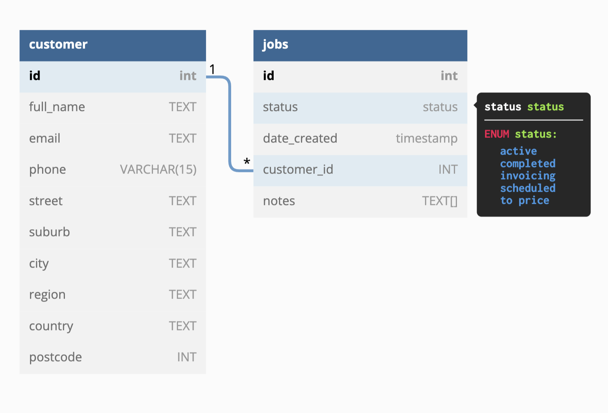

## Fergus Jobs API

### Scenario

As part of an interview process I have been asked to create with the front end or back end for a jobs application. The brief is as follows:

Please provide an application that allows a trades person to see their job list. jobs have the following information:

- Unique job identifier
- Status:
  - scheduled
  - active
  - invoicing
  - to price
  - completed
- Create date and time
- General client information such as name and contact details
- Filter and sort functionality
- The ability to click on the job and view the job specific information
- Change the status of the job

## Architecture


## Database setup (PostgreSQL)



## Parameters

### Get /jobs route (Query parameters)

| Parameters | Type    | Description                                                                                                                                                                   | Example                 |
| ---------- | ------- | ----------------------------------------------------------------------------------------------------------------------------------------------------------------------------- | ----------------------- |
| page       | integer | Allows for pagination functionality, selecting a page number. Must be a number greater than 1, default value = 1                                                              | /api/jobs?page=1        |
| limit      | integer | Allows for pagination functionality, selecting the number of items per page. Must be a number greater than 1, default value = 5                                               | /api/jobs?limit=5       |
| sortBy     | string  | Allows the application to sort the results by either: "jobId", "status", "dateCreated", "customer". An error will be returned if value is not valid. Default value = jobId    | /api/jobs?sortBy=jobId  |
| orderBy    | string  | Allows the application to choose whether to order by: "ASC", "DESC". An error will be returned if value is not valid. Default value = ASC                                     | /api/jobs?orderBy=ASC   |
| status     | string  | Allows the application to filter by status. Has to be either: 'active', 'completed', 'invoicing', 'scheduled', 'to price'. . An error will be returned if value is not valid. | /api/jobs?status=active |

### GET /jobs/:id route

By entering an id you are able to retrieve a specific job.

### PUT /jobs/:id route

Allows you to add a note to the job notes array and update the status to one of the following values: 'active', 'completed', 'invoicing', 'scheduled', 'to price'. The current functionality will require the front end to pass both properties through to the database. If only the note was updated then passing the current status value will be required.

## Getting Started

**To run the app:**

When the repo has been cloned and you are in the project folder within your terminal:

```zsh
docker-compose up --build
```

When the project is up and running then you can make API requests via localhost:5001/api/ to check functionality. This can be done either through your browser or through an API client such as [insomnia](https://insomnia.rest/) or [postman](https://www.postman.com/product/rest-client/)

## Dependencies

- [cors](https://www.npmjs.com/package/cors)
- [dotenv](https://www.npmjs.com/package/dotenv)
- [express](https://www.npmjs.com/package/express)
- [joi](https://www.npmjs.com/package/joi)
- [pg](https://www.npmjs.com/package/pg)
- [swagger-ui-express](https://www.npmjs.com/package/swagger-ui-express)
- [yamljs](https://www.npmjs.com/package/yamljs)

## Dev Dependencies

- [nodemon](https://www.npmjs.com/package/nodemon)
